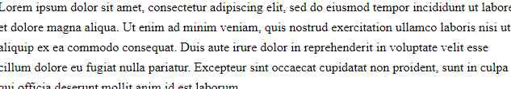

 [](https://www.npmjs.com/package/editorjs-overline-by-reregaga) [](https://www.npmjs.com/package/editorjs-overline-by-reregaga) [](https://cdn.jsdelivr.net/npm/editorjs-overline-by-reregaga@1.0.0/dist/bundle.js) 

# Overline Tool
Inline tool for overlining text fragments for the [Editor.js](https://github.com/codex-team/editor.js)



## Installation

### Install via NPM

Get the package

```shell
npm i --save editorjs-overline-by-reregaga
```

```shell
yarn add editorjs-overline-by-reregaga
```

Include module at your application

```javascript
import Overline from 'editorjs-overline-by-reregaga';
```

### Download to your project's source dir

1. Upload folder `dist` from repository
2. Add `dist/bundle.js` file to your page.

### Load from CDN

You can load the package from [jsDelivr CDN](https://www.jsdelivr.com/package/npm/editorjs-overline-by-reregaga) and require the script on a page with Editor.js.

```html
<script src="https://cdn.jsdelivr.net/npm/editorjs-overline-by-reregaga@latest"></script>
```

## Usage

Add a new Tool to the `tools` property of the Editor.js initial config.

```javascript
import EditorJs from '@editorjs/editorjs';
import Overline from 'editorjs-overline-by-reregaga';

var editor = new EditorJS({
  // ...
  tools: {
    // ...
    overline: Overline
  },
});
```

## Config Params

This Tool has no config params

## Output data

Underlined text will be wrapped with a `span` tag with an `reregaga-overline` class.

```json
{
    "type" : "text",
    "data" : {
        "text" : "Create a directory for your module, enter it and run <span class=\"reregaga-overline\">npm init</span> command."
    }
}
```
